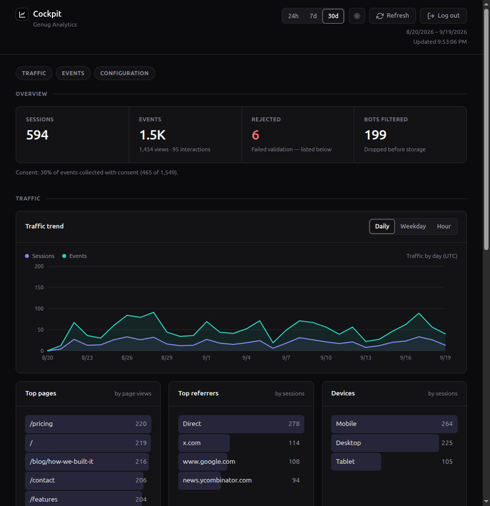

# Getting started

The short path from nothing to asking your first question. Every step
links to the page that has the details; this one has none of its own.

If you're on Coolify or behind Cloudflare Tunnel, skip step 4 — they
handle HTTPS for you and [deploying](deploying.md) covers both.

## What you need first

- **A server reachable on the internet, with Docker installed** — or
  just your own machine for step 3's local option, to look around
  before committing to a domain and a server.
- **A domain you already manage DNS for**, to add the subdomain in
  step 1.
- **Either a reverse proxy** (Caddy, nginx, Traefik — step 4) **or a
  platform that terminates TLS for you** (Coolify, Cloudflare Tunnel).
- **`openssl`**, for step 2's three secrets — already on virtually
  every Linux and macOS machine.



## 1. Pick a hostname

The collector has to live on a **subdomain of the site it tracks**:
`analytics.your-domain.com` for `your-domain.com`. Not a different
domain, not a hosting provider's shared one. Get this wrong and nothing
looks broken, but consenting visitors are forgotten every day.
→ [The hostname](deploying.md#the-hostname)

Add the DNS record now (an `A` record pointing at your server's
address) — it needs a few minutes to propagate, and step 4 needs it
already working.

## 2. Generate your secrets

Three secrets, no defaults — the server refuses to start without them,
deliberately, rather than coming up in an insecure state. Run this
three times and keep the three results somewhere safe, like a password
manager; you'll paste them into the next step:

```sh
openssl rand -hex 32
```

Which one is which doesn't matter yet — you'll assign them to
`SALT_SECRET`, `MCP_API_KEY` and `COCKPIT_PASSWORD` in a moment. Just
don't lose track of which value you used where.

## 3. Run it

For a first look on your own machine, with no server or domain needed
yet:

```sh
npm install
npm run build
DB_PATH=./genug.db \
ALLOWED_ORIGIN=https://your-tracked-site.com \
SALT_SECRET=<first-secret> \
MCP_API_KEY=<second-secret> \
COCKPIT_PASSWORD=<third-secret> \
node server/dist/index.js
```

For a real deployment, on a server with Docker installed, use the
image instead, with `/data` on a persistent volume so the database
survives a redeploy:

```sh
docker run --rm -d --name genug -p 127.0.0.1:3000:3000 \
  -e ALLOWED_ORIGIN=https://your-tracked-site.com \
  -e SALT_SECRET=<first-secret> \
  -e MCP_API_KEY=<second-secret> \
  -e COCKPIT_PASSWORD=<third-secret> \
  -v genug-data:/data \
  ghcr.io/datapip/genug-analytics:v0.6.0
```

`-p 127.0.0.1:3000:3000` binds the container to the machine itself,
not the internet — step 4 puts a reverse proxy in front of it, and
nothing else needs to reach port 3000 directly.
→ [Build and run with Docker](deploying.md#build-and-run-with-docker),
[Deploying on Coolify](deploying.md#deploying-on-coolify),
[Configuration](deploying.md#configuration) for what each variable does

## 4. Put a reverse proxy in front of it

The browser needs `https://analytics.your-domain.com` — the cockpit's
login cookie won't even be set over plain HTTP — and the `docker run`
above only gives you HTTP on a port number. [Caddy](https://caddyserver.com/docs/install)
is the least fiddly way to close that gap on a fresh Linux box: it
requests and renews the TLS certificate itself, no separate `certbot`
step. Install it, then put this in `/etc/caddy/Caddyfile`:

```
analytics.your-domain.com {
    reverse_proxy localhost:3000
}
```

```sh
sudo systemctl reload caddy
```

That's it, as long as the DNS record from step 1 already resolves to
this server and ports 80/443 are open in its firewall — Caddy answers
Let's Encrypt's validation request itself on first load.

One thing changes on the container now that something sits in front
of it: **add `-e TRUST_PROXY=1`** to the `docker run` command and
restart it. Without it the server logs Caddy's own address for every
visitor instead of theirs, which breaks both the daily visitor-id hash
and the `/events` rate limiter. → [Configuration](deploying.md#configuration)
for what the number means and when to raise it to `2` instead (Cloudflare
in front of Caddy, for instance).

Already on Coolify, or behind Cloudflare Tunnel, or terminating TLS
some other way? Skip this step — [deploying](deploying.md) has the
`TRUST_PROXY` value and the Cloudflare-specific caveats for those
setups instead.

## 5. Put the script on your site

Early in `<head>`. Nothing fires on its own until you turn page
tracking on, which is what the config object does:

```html
<script>
  window.genugAnalyticsConfig = { enableAutoPageTracking: true };
</script>
<script defer src="https://analytics.your-domain.com/client.js"></script>
```

→ [Embedding the client script](client.md#embedding-the-client-script),
[Tracking events](client.md#tracking-events) for clicks, downloads
and your own events

## 6. Watch the first event arrive

Open `https://analytics.your-domain.com/cockpit` with the
`COCKPIT_PASSWORD` you set (any username). Load a page on your site and
it shows up under **Recent events**. If it doesn't:

- Check the **Rejected** count in the top strip — it says why.
- Check the browser's console on your tracked site — an origin that
  isn't in `ALLOWED_ORIGIN` fails there as a CORS error, and never
  reaches the server's logs at all.
- If signing in to the cockpit seems to work but immediately asks you
  to sign in again, it's being served over plain HTTP — the session
  cookie needs HTTPS to be set. Confirm step 4 is actually in front of
  it: load the `https://` URL, not `http://` or the bare `:3000` port.

## 7. Connect an AI agent

Point any MCP client at `/mcp` with the `MCP_API_KEY`. For Claude Code
it is one line:

```sh
claude mcp add --transport http genug https://analytics.your-domain.com/mcp \
  --header "Authorization: Bearer YOUR_MCP_API_KEY"
```

Then ask it: _"What were my top pages this week, and where did that
traffic come from?"_
→ [Connecting an AI agent](mcp.md), including what you can ask and
what leaves your server when you do

## Before you go live

Two things the software cannot do for you:

- **Say what you collect** in your privacy notice, and name a legal
  basis. The field table and the checklist are written for exactly
  this. → [Running without a consent banner](privacy.md#running-without-a-consent-banner)
- **Say how long you keep it, if 425 days isn't right.** `RETENTION_DAYS`
  defaults to 425 days; set it if you want a different period, or `-1`
  to keep everything. Your notice should say which. → [Retention](operations.md#retention)

## Next

- [Make it yours](../README.md#make-it-yours) — the three recipes for
  adding events, adding MCP tools and changing the cockpit.
</content>
</invoke>
